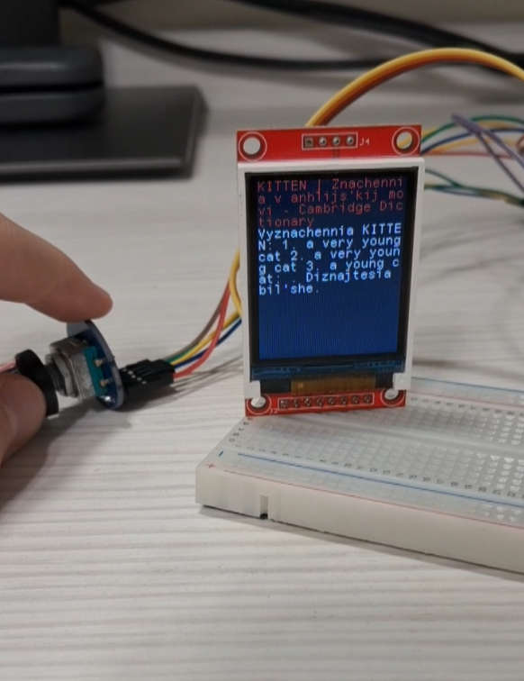

Тут зібрав найцікавіші зі своїх робіт, є ще проекти на STM32 з деякими модулями, які можна купити в Інтернеті.

## 1. car2024.ino
Це програма до Arduino машинки, керованої через IR пульт і Bluetooth застосунок на телефоні. Машинка зупиняється, коли бачить перед собою перешкоду(сонар видає відстань менше 22 см). Також я реалізував функцію запису маршруту, тобто напрямку і часу руху машинки в її оперативну пам'ять. Потім можна дати машинці команду через пульт чи телефон і вона поїде по тому ж маршруту(такий ж напрямок і час руху). Всього можна до 30 різних напрямків руху в пам'ять записати (це я в коді таке обмеження виставив, теоретично можна на скільки пам'яті вистачить). Також продумав такий нюанс, що коли під час повтору маршруту сонар бачить прешкоду, то машинка зупиняється. Я використовував бібліотеки ServoTimer2.h версії 0.1 і IRremote.h версії 4.4.0. Напрямок руху висвітлюється на передньому точковому LED дисплеї. Сама машинка це KS0470 Keyestudio 4WD BT Robot Car V2.0 Kit for Arduino.
## 2. game2.rar і game_rar.rar
Це ігри на Python, які використовують вбудовану бібліотеку tkinter. Я додав дві версії, бо раніша версія скомпільована в .exe і запуститься навіть без середовища для Python. Game2 це пізніша версія, графіка там у вигляді окремих файлів-картинок, які підгружаються. Керування там через квавіші-стрілочки. Це простенькі ігри, де треба збивати блоки за допомогою м'ячика, який відбивається від квадратної ракетки, якою ми керуємо. У другій версії гра закінчується, коли м'яч падає вниз вікна гри.
## 3. Olimpiad_program
Це задача з олімпіади з інформатики. Задача була ось така. Була табличка розміром N x M, розмір вводимо з клавіатури під час програми. В кожній клітинці дріт з'єднує два протилежні кути, його розташування може бути \ або /. Потрібно було написати програму, яка вирішила б, які потрібно змінити клітинки (з \ в / або навпаки), щоб з мінімальною кількістю змін з'єднати за допомогою оцих дротів в клітинках лівий верхній і правий нижній кути таблиці. Тобто, наприклад, при вводі рядків:

(треба дивитися в коді readme.md, бо гітхаб щось робить з тими символами)

3 5 
\ \ \ / \; 
/ / / / /;
\ \ \ / \
(в програму треба заводити без пробілів)

Ми маємо отримати результат, що в клітинці 1 рядка, 2 стовпця треба змінити клітинку. Тоді обидва кути таблиці будуть з'єднані дротом. Я цю задачу реалізував методом перебору і тестування всіх можливих варіантів. Максимум вона може видати результат, де треба змінити 2 клітинки, бо якщо треба 3 зміни, то вона не вирішить задачу. Результатом роботи є вивід двох кооординат, рядка(від 0 до N-1) і стовпця (від 0 до M-1).
## 4. main.py
Це є код до телеграм бота на Python. Цей бот показував клавіатуру з двома кнопками Weather і Rates, при натисканні Weather він питав місто. Можна було текстом написати місто і він видавав опис погоди в тому місті з сайту Sinoptik. А при натисканні на кнопку Rates мав показувати курс валют з сайту https://rates.ideil/. Потім я почав переписувати під https://kurs.com.ua//. Зараз ніби вже закрили отой перший сайт. Щоб запустити той код, я використовував середовище PyCharm і встановлював там бібліотеки telebot, requests, bs4. Треба було ще коду дати токен від будь-якого бота (його телеграм видає при створенні нового бота).

## 5. Adjustable Signal Generator Based on the AD9833

This project has implemented the following:
1. Convenient graphical menu on the TFT display for setting the frequency and shape of the analog signal (sine wave, triangular signal, meander);
2. The Menu is controlled by the encoder with a button;
3. Generating of the selected analog signal.
This project can be useful for any experiments where you need to get a signal of a certain frequency and shape, for example, to test radio data reception at different frequencies, to clock chips, and etc.

## How to Use the Main Menu
When the project is powered up, the main menu appears. In order to select the desired option (frequency or waveform), move the cursor to the option and click on the button. In order to switch between menu items, turn the encoder knob. Turn clockwise in order to select the menu item on the right or below. Turn counterclockwise in order to select the menu item on the left or above. The menu item on which the cursor is currently positioned is highlighted in white. In order to activate a selected menu item, click the encoder button.

## Frequency Menu
There is the Back button at the top to the left of the label “Frequency”, which returns you to the main menu. Below the label “Frequency” there are seven digits to select frequency. When you turn the knob, the cursor selects a digit and underlines the selected one. By pressing the button, the underlined digit is highlighted. By turning the knob you can change the digit from 0 to 9. When the necessary digit is chosen, press the button. Then by turning the knob you can select another digit to change. The maximum frequency to set is 10MHz. After setting the frequency, select the OK button and click the encoder button and the frequency of the output signal is changed. After that the OK button turns green.

## Signal Shape Menu
The operation is the same as described above in the Main Menu. On the right Waveform Menu, there are pictures showing how each of the waveforms looks like. In order to back to the Main Menu, select and click the Back button at the top to the left of the label “Signal Shape”.

## How to Install This Project
If you use the same model of STM32 microcontroller as in the decribed project, you just need to download the ZIP archive and connect modules with wires the same way as shown in the Connections Diagram. Then import the STM32CubeIDE project from ZIP archive using the CubeIDE and download the project into microcontroller using CubeIDE and STLINK programmer. But if you plan to use a different model of the STM32 controller, you need to create a new project for your controller, enable any 1 hardware SPI, and name the microcontroller outputs in the same way as in the described project. Next, you need to copy the library files for the TFT screen from the Inc and Src folders (namely **fonts.h**, **st7735.h**, **st7735_cfg.h**, **fonts.c**, **st7735.c**), copy the code from the **main.c** file to the **main.c** of your project.

## Hardware Used
1. WeAct 3.0 development board with STM32F401CEU6 microcontroller.
2. CJMCU-9833 signal generator module with AD9833 generator chip.
3. 1.8-inch TFT screen on the ST7735S controller with 168x120 pixels.
4. EC11 encoder module.
5. STLINK V2.0 programmer
6. Breadboard and DuPont wires.

## Note
The AD9833 outputs the maximum voltage of 0.65 V when generating a triangle or sine waveform. When producing a meander (rectangular) signal, the maximum output is 3V.

I also think that the code that deals with menu should be remade so the 'back' button and 'button recolouring when pressed' features are implemented in separate functions in code. This is better implementation because this makes **InterfaceReaction** function shorter and also creates advantages when implementing a new menu window(new option to configure)/

## Wiring Diagram

## 6.EthernetTask

Це ще один проект на STM32 з Ethernet модулем на мікросхемі ENC28J60, модулем енкодера EC11 та 1,8 дюймовим TFT екраном на контроллері ST7735S. Після запуску мікроконтролер дістає з Інтернету результати пошуку в Google за запитом kitten. Далі результати пошуку виводяться в форматі "заголовок сайту - фрагмент тексту з сайту, який видає пошук Google". За допомогою енкодера можна перелистувати весь список результатів пошуку. Після запуску є затримка на 12 секунд для отримання IP-адреси мікросхемою від маршрутизатора і отримання сторінки з Інтернету для її подальшого парсингу. Затримка 12 секунд відбувається завжди, незалежно від того, коли була опрацьована сторінка.

## 7.GPSTask

У цьому проекті я почав працювати з GPS датчиком, а саме парсингом протоколу NMEA. Тут я реалізував парсинг і виведення координат на екран у форматі градуси-мінути-секунди-частки секунди. Також є парсинг повідомлення GSV, де описуються число, координати в небі та сила сигналу видимих супутників.
